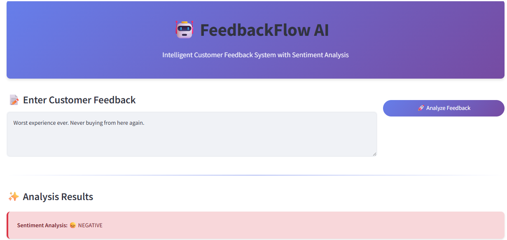
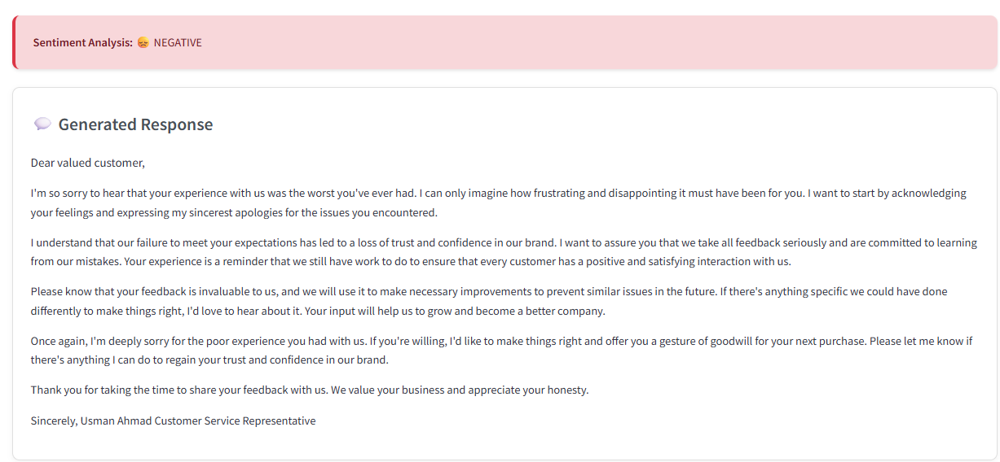
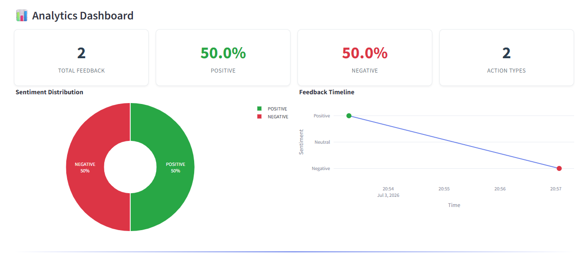
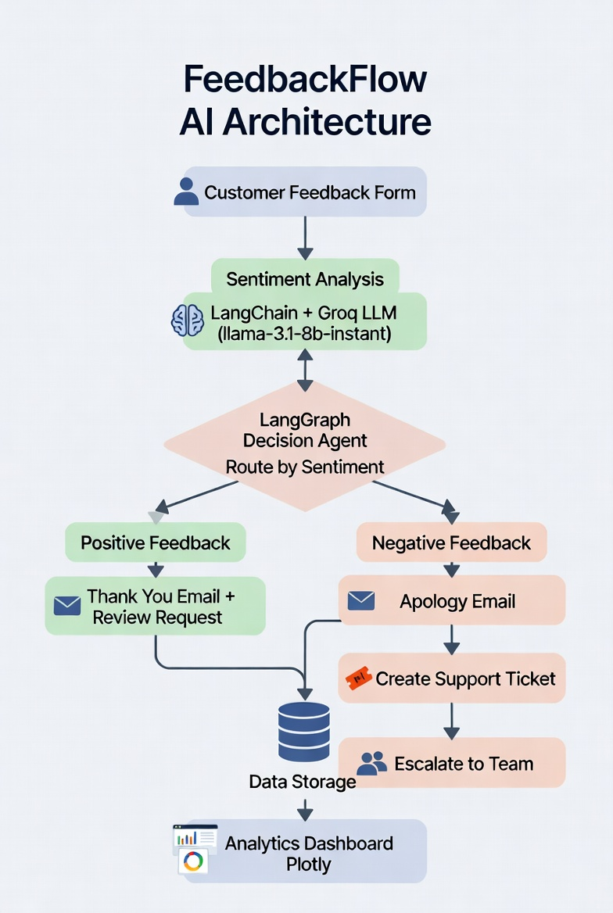

# 🤖 FeedbackFlow AI
**Intelligent Customer Feedback System with Sentiment Analysis & Automated Email Responses**


---

## 📋 Table of Contents
- [Project Overview](#-project-overview)
- [Objectives](#-objectives)
- [Key Features](#-key-features)
- [Methodology & Architecture](#-methodology--architecture)
- [Tech Stack](#-tech-stack)
- [Installation](#-installation)
- [Configuration](#-configuration)
- [Usage](#-usage)
- [Email Workflow](#-email-workflow)
- [Analytics Dashboard](#-analytics-dashboard)
- [Testing](#-testing)
- [Deployment](#-deployment)
- [Troubleshooting](#-troubleshooting)
- [Contributing](#-contributing)
- [License](#-license)

---
## 🚀 Live App

**Try the Intelligent Customer Feedback System live:**

[](https://intelligent-customer-feedback-system-ags547t5q6uwfreqzfoef4.streamlit.app/)

---

## 🎯 Project Overview

**FeedbackFlow AI** is a production-ready intelligent customer feedback management system. It automatically analyzes customer feedback using AI, determines sentiment, generates personalized email responses, and triggers appropriate business actions (e.g., support ticket creation).

The system combines the speed of Groq’s LLM with LangGraph orchestration and a clean Streamlit interface, making it easy for teams to handle feedback at scale.

---

## 📌 Objectives

- Automate sentiment analysis of customer feedback in real-time
- Deliver personalized, professional email responses instantly
- Reduce manual effort in customer support
- Improve customer satisfaction through timely and appropriate replies
- Provide actionable insights through an interactive analytics dashboard
- Enable seamless escalation for negative feedback

---

## ✨ Key Features

### 🧠 Sentiment Analysis
- Real-time classification: **Positive / Negative / Neutral**
- Powered by Groq’s `llama-3.1-8b-instant` model
- Reliable prompt engineering for consistent results

- ## 🧠 Sentiment Analysis



### 📧 Automated Email Responses
- **Positive Feedback**: Thank you + request for 5-star review
- **Negative Feedback**: Sincere apology + support ticket creation + escalation
- Professional and empathetic tone

  ## 📧 Automated Email Responses




### 📊 Analytics Dashboard
- Sentiment distribution charts (Plotly)
- Feedback timeline
- Key metrics (Total, Positive %, Negative %)
- Searchable feedback history
- Export data to CSV

- ---

## 📊 Analytics Dashboard



---

### 🎨 User Interface
- Modern, responsive Streamlit UI
- Color-coded sentiment indicators
- One-click demo feedback samples

---

## 🏗️ Methodology & Architecture

1. **Input** → Customer submits feedback via form
2. **Analysis** → LangChain + Groq LLM performs sentiment analysis
3. **Decision** → LangGraph agent routes the feedback based on sentiment
4. **Action**:
   - Positive → Thank you email
   - Negative → Apology email + Support ticket + Escalation
5. **Storage & Visualization** → Data saved and displayed on analytics dashboard

The architecture is modular, scalable, and easy to maintain.

## 🖼️ System Architecture




---

## 🛠️ Tech Stack

| Component       | Technology              | Version    |
|-----------------|-------------------------|------------|
| Framework       | Streamlit               | 1.37.1     |
| LLM Provider    | Groq                    | API        |
| Model           | Llama 3.1 8B Instant    | -          |
| Orchestration   | LangChain + LangGraph   | 0.3.7 / 0.2.45 |
| Email           | SMTP (Gmail)            | -          |
| Visualization   | Plotly                  | 5.24.1     |
| Data Processing | Pandas                  | 2.2.3      |
| Configuration   | python-dotenv           | 1.0.1      |

---

## 🚀 Installation

```bash
# Clone the repository
git clone <your-repo-url>
cd FeedbackFlow-AI

# Create virtual environment
python -m venv venv
source venv/bin/activate    # Windows: venv\Scripts\activate

# Install dependencies
pip install -r requirements.txt
